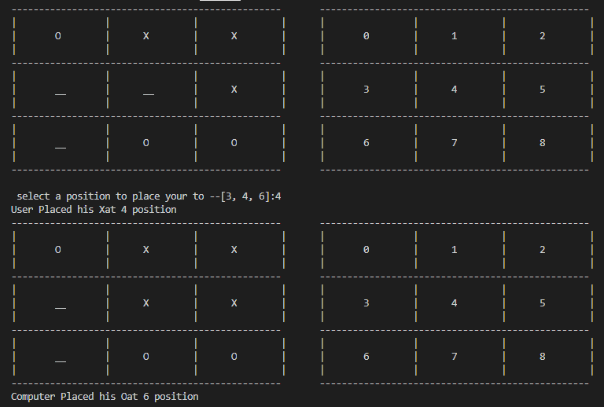

# TIC TAC TOE (Dumb version)

A small OOP oriented tic tac toe game in java, playable in terminal when compiled. made it in last 1 hour in notepad. Does NOT have any ai or special program to make computer win, he just guesses randomly from the available set of positions. (Though i guess integrating such algorithm won't be much difficult)

No idea why i made it

